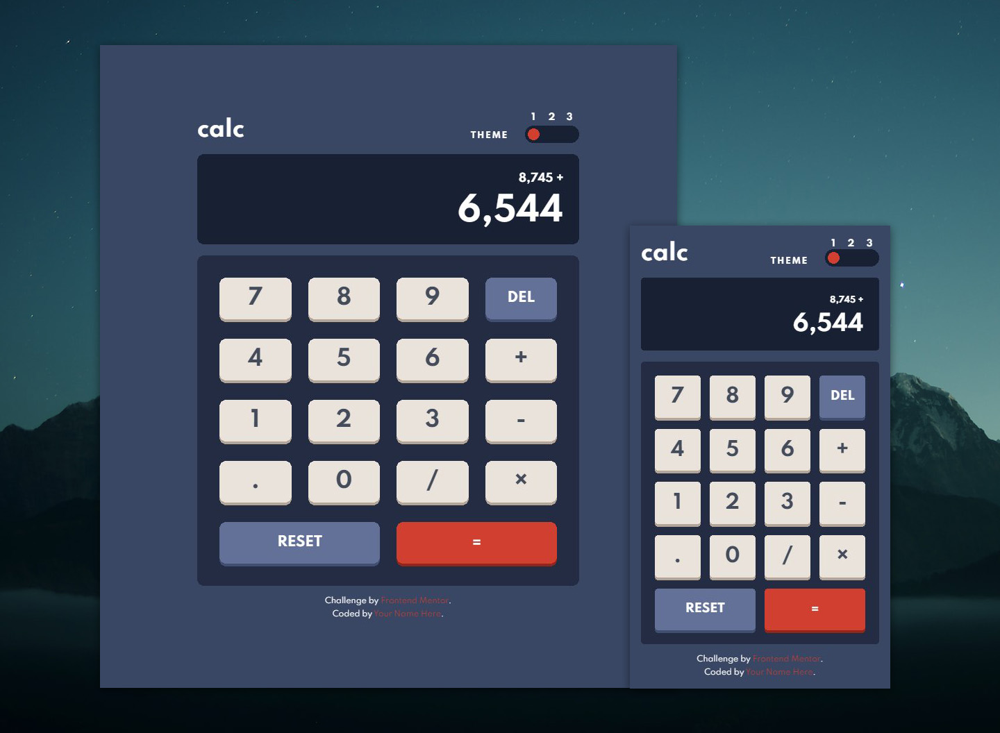

# Frontend Mentor: Calculator app solution

This is my solution to the [Calculator app challenge on Frontend Mentor](https://www.frontendmentor.io/challenges/calculator-app-9lteq5N29). Frontend Mentor challenges help you improve your coding skills by building realistic projects.

## Table of contents

- [Overview](#overview)
  - [The challenge](#the-challenge)
  - [Screenshot](#screenshot)
  - [Links](#links)
- [My process](#my-process)
  - [Built with](#built-with)
  - [What I learned](#what-i-learned)
  - [Continued development](#continued-development)
  - [Useful resources](#useful-resources)
- [Author](#author)
- [Acknowledgments](#acknowledgments)

## Overview

### The challenge

Users should be able to:

- See the size of the elements adjust based on their device's screen size
- Perform mathmatical operations like addition, subtraction, multiplication, and division
- Adjust the color theme based on their preference
- **Bonus**: Have their theme preference saved in the browser, with the theme being loaded upon the page being loaded.

### Screenshot

Here are the final screenshots of this project, which honestly took a bit longer than I thought it would due to my unfamiliarity with certain aspects of the coding side of this. To be honest, I'd never created a calculator app before, or implemented one with a theme slider that could save the last selected theme to the browser, but I guess it helps to know how to do it now. :)

### Links

- Solution URL: [Here's a link to the Github repository](https://github.com/Valkinsenn/frontend-mentor--calculator-app-main).
- Live Site URL: [And here's this bad boy in action](https://valkinsenn.github.io/frontend-mentor--calculator-app-main/).

## My process

### Built with

- HTML5 markup
- Custom CSS
- CSS Grid
- CSS Flexbox
- Mobile-first design

### What I learned

Well, first and foremost, I learned how to create a working calculator app. It's nothing as glamorous as a graphic calculator, but it still works as its supposed to, and that's what matters. I also learned about ways to create a working theme switcher too, along with saving the last selected theme on a user's browser so it automatically loads the next time the page is loaded.

### Continued development

Just for kicks, I'd like to add some 3D stuff to this project, and maybe add in some glassmorphism styling, too.

### Useful resources

- [Google](https://www.google.com) - Probably **the** most valuable tool in a web developers arsenal, frontend or backend. Any search engine would do, though.
- [Kevin Powell | Dark mode theme switch example](https://codepen.io/kevinpowell/pen/EMdjOV?editors=0010) - This Codepen and the corresponding video [here](https://www.youtube.com/watch?v=wodWDIdV9BY) was instrumental in helping me to understand how to create themes to switch back and forth between at will. It also helped me better understand storing stuff, like theme data, in the browser's cache.
- [Stack Overflow | Watching a form for changes](https://stackoverflow.com/questions/10760847/entire-form-onchange) - This gave me a quick refresher on getting JavaScript to watch a form for changes.
- [Stack Overflow | Getting JavaScript to swap between different radio buttons](https://stackoverflow.com/a/16108679) - This helped with getting JavaScript to change which radio buttons a checked in a form.
- [Web Dev Simplified | Building a Calculator with JavaScript](https://www.youtube.com/watch?v=j59qQ7YWLxw) - I could not have gotten the calculator to function properly without this invaluable tutorial. It also helped reinforce my budding knowledge of JavaScript classes (still got a ways to go, though).

## Author

- Website - I'm working on it, danget! lol
- Frontend Mentor - [@valkinsenn](https://www.frontendmentor.io/profile/valkinsenn)
- Twitter - [@valkinsenn](https://www.twitter.com/valkinsenn)

## Acknowledgments

- **Kevin Powell**. Without a doubt, the undisputed _king_ of CSS and a fantastic teacher whose tutelage I honestly couldn't live without.
- **Web Dev Simplified**. I don't know his name off the top of my head, but he's very knowledgeable about JavaScript and CSS, and I would've been dead in the water on this project without his tutorial on how to make it happen. The link to said tutorial is under [useful resources](#useful-resources).
